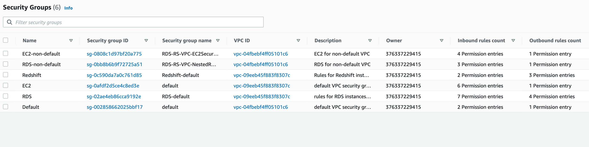

# VPC in AWS

A VPC is basically a virtual network segment that is provided to AWS customers in our cloud, similar to a traditional
network that you'd operate in your on-prem infra or data center [1]. Naturally, a network would come with subnets which are
logical divisions of the same. You can have a single subnet or multiple subnets depending on your need. In AWS, we
classify the subnet further as a "Public" or "Private" subnet. The most basic difference between the two is that, for
instances in a "public" subnet, we can talk "back" to them from internet, while instances in "private" subnet are
unreachable from the internet. See AWS references [2,3]

Also, "public" and "private" are just nomenclature or logical names used for subnets. The "thing" that makes a subnet
public is an AWS solution called as "Internet Gateway" (lets denote this 'IGW' for future reference). As per AWS docs, an
IGW enables resources (like EC2 instances) in your public subnets to connect to the internet if the resource has a public
IPv4 address or an IPv6 address. Similarly, resources on the internet can initiate a connection to resources in your
subnet using the public IPv4 address or IPv6 address. IGW basically serves two purposes: to provide a target in your
VPC route tables for internet-routable traffic, and to perform network address translation (NAT)
for instances that have been assigned public IPv4 addresses. For this to be possible, the route table attached to a
"public" subnet should have a route configured with default gateway pointing to IGW attached to the said VPC. Also,
one can connect back to a public instance from internet using the Elastic IP or auto-assigned public IP configured in
instance configuration. IGW is discussed in [4].

Now, instances in a "private" subnet wont have any routes pointing their default gateway to an IGW (else they wont be
called private). Thus, they wont be able to talk out to the internet. However, there are scenarios where instances in
"private" subnets would need internet access (say for performing updates). This is where NAT gateway (lets denote this 'NGW'
for future reference) fits in. A NGW basically allows instances in "private" subnet to connect to services outside the
VPC, however, external services cannot initiate a connection with those instances. The NGW replaces the source IP address
of the instances with the IP address of the NAT gateway. Thus, for private instances to be able to talk to internet,
the NGW associated with them should itself be in a "public" subnet. The internet flow then looks like below:

(Private Instance) ----> NGW -----> IGW ---> Internet

We will also have scenarios where we would need instances in one VPC to talk to other instances in a different VPC in
same or different AWS accounts. This can be achieved by means of solutions like "VPC Peering Connection" or a "AWS
Transit Gateway". At the core of it, you would basically have a route for remote VPC subnet with the "gateway" pointing
to either a VPC peering connection or Transit GW as appropriate.
A VPC peering connection is a networking connection between two VPCs that enables you to route traffic between them using private IPv4 addresses
or IPv6 addresses. Instances in either VPC can communicate with each other as if they are within the same network. You can create a VPC peering connection between your own VPCs, or with a VPC in another AWS account.
The VPCs can be in different regions (also known as an inter-region VPC peering connection).

Now, apart from VPC, we have multiple other AWS provided solutions (like RDS, S3, etc). These services are usually reachable from internet. However,
AWS also allows you to privately connect your VPC to supported AWS services without requiring an internet gateway, NAT device,
VPN connection, or AWS Direct Connect connection. This is achieved by means of "Endpoints".
Endpoints are virtual devices that are horizontally scaled, redundant, and highly available VPC components. V
PC endpoints allow communication between instances in your VPC and services, without imposing availability risks or
bandwidth constraints on your network traffic. You can optimize the network path by avoiding traffic to internet gateways
and incurring cost associated with NAT gateways, NAT instances or maintaining firewalls. VPC endpoints also provide you with much finer control over how users and applications access AWS services.
With VPC endpoints enabled, Instances in your VPC do not require public IP addresses to communicate with the Amazon services. Traffic between your VPC resources and the Amazon service (For ex: SQS, Secrets manager etc) does not leave the Amazon network.
VPC endpoints allows you to connect Amazon services only within the region.

There are two types of VPC endpoints.

1. A Gateway endpoint is a target for a route in a route table to connect VPC resources to S3 or DynamoDB. When enabled, the route table automatically updates the prefix list of service and target endpoints.
Gateway endpoint is created at the VPC level and not at the subnet level. A route is automatically added to the Route table with a destination that specifies the prefix list of service and the target with the endpoint id for e.g. A rule
   with destination pl-68a54001 (com.amazonaws.us-west-2.s3) and a target with this endpoints’ ID (e.g. vpce-12345678) will be added to the route tables
A Gateway endpoint, currently allows you to connect to Amazon Simple Storage Service (S3) and Amazon DynamoDB service using private IP addresses. You route traffic from your VPC to the gateway endpoint using route tables. Gateway endpoints do not enable AWS PrivateLink.
You can also configure resource policies on both the gateway endpoint and the AWS resource that the endpoint provides access to. A VPC endpoint policy is an AWS Identity and Access Management (AWS IAM) resource policy that you can attach to an endpoint. It is a separate policy
   for controlling access from the endpoint to the specified service. This enables granular access control and private network connectivity from within a VPC.
Note: As mentioned above, Gateway endpoints are available only for Amazon S3 and Amazon DynamoDB services, and they are available at no additional cost. Gateway endpoints can only be used by the resources within the VPC.

* Limitations:

1) Endpoints are supported within the same Region only. Endpoint cannot be created between a VPC and an AWS service in a different region.
2) Endpoints support IPv4 traffic only.
3) Endpoint cannot be transferred from one VPC to another, or from one service to another
4) Endpoint connections cannot be extended out of a VPC i.e. resources across the VPN connection, VPC peering connection, AWS Direct Connect connection cannot use the endpoint.

2. Interface endpoints

Interface endpoints enable connectivity to services over AWS PrivateLink. WS PrivateLink is a service which basically provides Amazon VPCs with a secure and scalable way to privately connect
to such hosted services. AWS PrivateLink traffic does not use public IP addresses nor traverse the internet.
The Interface endpoints reside inside a subnet and need to be in an Availability Zone (for HA, put one in each AZ)
While creating Interface endpoint, It will allow you to choose a subnet from your VPC. For each subnet that you specify from your VPC, we create an
endpoint network interface in the subnet and assign it a private IP address from the subnet address range.
A private IP address also ensures the traffic remains private without any changes to the route table.
AWS recently enabled AWS PrivateLink support for S3 and DynamoDB service. So, We can use Interface endpoint for S3 and DynamoDB service as well.
For Interface endpoints, You are billed for hourly usage and data processing charges. https://aws.amazon.com/privatelink/pricing/
Interface endpoint has its own set of DNS names, including one for AZ, region and private DNS name.
You can use regional (or) AZ level DNS name as well to access your Interface endpoint.
For Example consider secret manager service:

vpce-08e129ac470yyyyyy-xxxxxx.secretsmanager.us-east-1.vpce.amazonaws.com  --> Regional DNS Name
vpce-08e129ac470yyyyyy-xxxxxx-us-east-1a.secretsmanager.us-east-1.vpce.amazonaws.com  ---> Zonal DNS name
secretsmanager.us-east-1.amazonaws.com   ---> DNS Name of Secrets manager service in us-east-1 region

Normally, DNS name of the AWS service resolves to regional Public IPs. When you enable 'private DNS name' for the interface endpoint, DNS name of Secrets manager service will start resolve to private IPs.
In comparison, Gateway Endpoints described above are limited to providing connectivity to Amazon S3 and DynamoDB service only and they do not leverage AWS PrivateLink.


Now, further access for IP's is controlled individually at each instance level by means of Security Group (SG).
SG's are discussed in reference [5]

#### References
1) https://docs.aws.amazon.com/vpc/latest/userguide/how-it-works.html
2) https://docs.aws.amazon.com/vpc/latest/userguide/VPC_Scenario1.html
3) https://docs.aws.amazon.com/vpc/latest/userguide/VPC_Scenario2.html
4) https://docs.aws.amazon.com/vpc/latest/userguide/VPC_Internet_Gateway.html
5) https://docs.aws.amazon.com/vpc/latest/userguide/VPC_SecurityGroups.html


This repo shows examples of AWS options for configuring VPC and allowing network traffic to internet
and other services. We will deploy a flask application in ec2 instance in VPC and communicate with RDS instance in same VPC
and Redshift in separate VPC.

#### Setup venv

First `cd` to the `eb-flask` folder in `aws-vpc` and then run the following command to setup a virtual env named `virt` and activate it

```
(base) rk1103@Ryans-MacBook-Air eb-flask % virtualenv virt
created virtual environment CPython3.9.1.final.0-64 in 2870ms
  creator CPython3Posix(dest=/Users/rk1103/Documents/AWS-VPC/aws_vpc/eb-flask/virt, clear=False, no_vcs_ignore=False, global=False)
  seeder FromAppData(download=False, pip=bundle, setuptools=bundle, wheel=bundle, via=copy, app_data_dir=/Users/rk1103/Library/Application Support/virtualenv)
    added seed packages: pip==22.0.4, setuptools==62.2.0, wheel==0.37.1
  activators BashActivator,CShellActivator,FishActivator,PowerShellActivator,PythonActivator,XonshActivator
(base) rk1103@Ryans-MacBook-Air eb-flask % source virt/bin/activate
```

Install the dependencies from the `requirements.txt` file in `eb-flask` folder. If you want to install the development
dependencies then install from `requirements_dev.txt`

```
(virt) (base) rk1103@Ryans-MacBook-Air eb-flask % pip install -r requirements.txt
```

To view installed dependencies in the environment run `pip freeze`

```
(virt) (base) rk1103@Ryans-MacBook-Air eb-flask % pip freeze

boto3==1.24.2
botocore==1.27.2
click==7.1.2
Flask==2.0.3
itsdangerous==2.1.2
Jinja2==3.1.1
jmespath==1.0.0
MarkupSafe==2.1.1
python-dateutil==2.8.2
s3transfer==0.6.0
six==1.16.0
urllib3==1.26.9
Werkzeug==2.1.0
```


#### Create AWS resource using CloudFormation

The AWS Cloudformation templates are stored in `templates` folder. Apart from the template `vpc.yaml`, the rest are arranged in a heirarchy (nested stacks) where the root stack `nested-stack.yaml`
is the  top level stack referencing the other nested stacks (`redshift.yaml`,`rds-resource.yaml`, `batch-job.yaml`, `code-deploy.yaml`, `ec2.yaml`). More info about nested stacks in the AWS docs https://docs.aws.amazon.com/AWSCloudFormation/latest/UserGuide/using-cfn-nested-stacks.html

Root stack `nested-stack.yaml` uses the AWS::CloudFormation::Stack resource to reference the child stack template containing the required resouce configuration,
with a `DeletionPolicy::Retain`. The nested AWS::CloudFormation::Stack definition in the parent stack template matches the actual nested stack's template
which needs to be uploaded to S3 and https url referenced in the `TemplateURL` property.

 


To validate cloud formation template(s) run the following command as below (replacing the template path with the path to your template) which should return a ValidationError if the template is malformed or contains incorrect keys, syntax errors or references to logical ids etc

```
$ aws cloudformation validate-template --template-body file://templates/redshift.yaml

An error occurred (ValidationError) when calling the ValidateTemplate operation: Template format error: Unrecognized parameter type: Bool
```

First we need to create the vpc resources from `vpc.yaml`. We can use the command below https://docs.aws.amazon.com/cli/latest/reference/cloudformation/create-stack.html or do this from the console.
https://docs.aws.amazon.com/AWSCloudFormation/latest/UserGuide/cfn-console-create-stack.html

```Shell
aws cloudformation create-stack \
--stack-name non-default-vpc \
--template-body "file://${repo_root}/templates/vpc.yaml" \
--parameters ParameterKey=NatGateway,ParameterValue=true \
ParameterKey=InterfaceEndpoint,ParameterValue=true \
```

Navigating to the VPC dashboard in AWS - we can see the public and private subnets associated with the VPCS

 


Each of these subnets has a route table which contain a set of routes to define where network traffic from subnet
or gateway is directed. For the private subnet, traffic from the subnet to the public internet (`0.0.0.0/0`) is directed
via the NAT gateway (`nat-0556f55bf98f77b90`).
We have also configured a VPC endpoint `vpce-0c67618e7d07b7d22` to access S3 (`pl-63a5400a` is prefix id for
S3), which can be seen in the route table

 

For the public subnet, we have a route from the subnet to the Internet gateway (`igw-004cbef6dac3f9770`) to the
public internet.  As with the private sunet, we have also configured the public subet to access S3 via the same
VPC endpoint (`vpce-0c67618e7d07b7d22`).


 

All the security groups for EC2, RDS, Redshift , with inbound and outbound rules should be created as below

 


There should be two S3 gateway endpoints (one for each VPC) to allow commununcation between resources in any subnet in both VPCs and S3.
The interface endpoint (powered by AWS PrivateLink) is configured for Secrets Manager to allow traffic to go through AWS network

 


we can also analyse the route between source and destination https://docs.aws.amazon.com/vpc/latest/reachability/getting-started.html
and see if it is reachable with new configuration. e.g. below  we have created a route between Ec2 instance and VPC peering connection and analysed the path. if the route table and security  groups were congiured correctly, then there should be a successful path as analysed below

 


Running the bash script create_stacks.sh  will create all the nested stacks and root stack,
using the create-stack action for cloudformation via cli https://docs.aws.amazon.com/cli/latest/reference/cloudformation/create-stack.html
Prior to doing this, it will also copy all the child stack templates to S3 bucket as these paths are referenced in the root template.
When running the command below, replace <username> and <password> with the required usernames and passwords you wish to set for redhsift cluster and rds db instance
respectively. <ip> should be the client ip you wish to grant access to the db (must be of the format 191.255.255.255/24). Note the trailing
slash .Can be checked by launching EC2 instance from console - Network Settings -> tick the 'Allow SSH traffic from' box and select 'My IP'
from the dropdown which should show your IP address in the required format.
The path to repo root should be set e.g. '/e/Documents/AWS-VPC'. The script uses this to fetch the path to cf template files in repo.
The last two params determine if nat gateway and elastic ip are created or not. By default, this is set to true so to avoid
creating these - then set these to false (as in command below)

```
$ sh aws_vpc/create_stacks.sh <username> <password> <ip> <path-to-gh-repo-root> false false

Uploading templates to s3:
upload: templates/redshift.yaml to s3://cf-templates-wnxns0c4jjl4-us-east-1/redshift.yaml
upload: templates/code-deploy.yaml to s3://cf-templates-wnxns0c4jjl4-us-east-1/code-deploy.yaml
upload: templates/batch-job.yaml to s3://cf-templates-wnxns0c4jjl4-us-east-1/batch-job.yaml
upload: templates/rds-resource.yaml to s3://cf-templates-wnxns0c4jjl4-us-east-1/rds-resource.yaml
upload: templates/nested-stack.yaml to s3://cf-templates-wnxns0c4jjl4-us-east-1/nested-stack.yaml
upload: templates/ec2.yaml to s3://cf-templates-wnxns0c4jjl4-us-east-1/ec2.yaml
upload: templates/vpc.yaml to s3://cf-templates-wnxns0c4jjl4-us-east-1/vpc.yaml

Creating nested stacks:

{
    "StackId": "<arn>"
}
```


To update nested stacks if parameters of root stack have not changed, run the following
update script - passing in the root of the gh repo as the first arg.

```
sh aws_vpc/update_stacks.sh <repo-root>

Uploading templates to s3:
upload: templates/redshift.yaml to s3://cf-templates-wnxns0c4jjl4-us-east-1/redshift.yaml
upload: templates/code-deploy.yaml to s3://cf-templates-wnxns0c4jjl4-us-east-1/code-deploy.yaml
upload: templates/batch-job.yaml to s3://cf-templates-wnxns0c4jjl4-us-east-1/batch-job.yaml
upload: templates/rds-resource.yaml to s3://cf-templates-wnxns0c4jjl4-us-east-1/rds-resource.yaml
upload: templates/nested-stack.yaml to s3://cf-templates-wnxns0c4jjl4-us-east-1/nested-stack.yaml
upload: templates/ec2.yaml to s3://cf-templates-wnxns0c4jjl4-us-east-1/ec2.yaml
upload: templates/vpc.yaml to s3://cf-templates-wnxns0c4jjl4-us-east-1/vpc.yaml

Updating nested stacks:

{
    "StackId": "arn:aws:cloudformation:us-east-1:376337229415:stack/Nested-RDS-Redshift-EC2-VPC/9070c9e0-ecfb-11ec-9503-0a897404d5d5"
}

```

To teardown the cloudformation stacks run the teardown.sh bash script. This assumes the root stack name
is `Nested-RDS-Redshift-EC2-VPC`

```
$ sh aws_vpc/teardown.sh

Deleting stack "Nested-RDS-Redshift-EC2-VPC-NestedRDSStack-BSEMIHK53ZLW",

Deleting stack "Nested-RDS-Redshift-EC2-VPC-NestedRedshiftStack-AFT0JOJNX7YV",

Deleting stack "Nested-RDS-Redshift-EC2-VPC-NestedEC2Stack-CH12LH075898",

Deleting stack "Nested-RDS-Redshift-EC2-VPC-NestedVPCStack-1BIMJOPPQGS81",

Deleting stack "Nested-RDS-Redshift-EC2-VPC",

```

 Alternatively, from the console:
    * create stack with new resources
    * upload sample tempate (root stack template i.e. `nested_stack.yaml`)
    * add stack details -> input stack name and parameters if required
    * Leave default settings in configure stack options and review steps
    * Before creating stack, tick the `I acknowledge` checkboxes in capabilites section


If successful you should see the parent stack and nested stacks all created successfully as in the
image below, where `Nested-RDS-Redshift-VPC` is the root stack and the three above are the child stacks which
were referenced in the root stack template. The resources (logical-id, physics-id and
type) created can  be found in the 'resources' tab for each stack.
If there is an error, then check the reason in the 'events' tab of the child stack that has thrown the error.

</img>


### Credits

This package was created with Cookiecutter_ and the `audreyr/cookiecutter-pypackage`_ project template.

.. _Cookiecutter: https://github.com/audreyr/cookiecutter
.. _`audreyr/cookiecutter-pypackage`: https://github.com/audreyr/cookiecutter-pypackage
