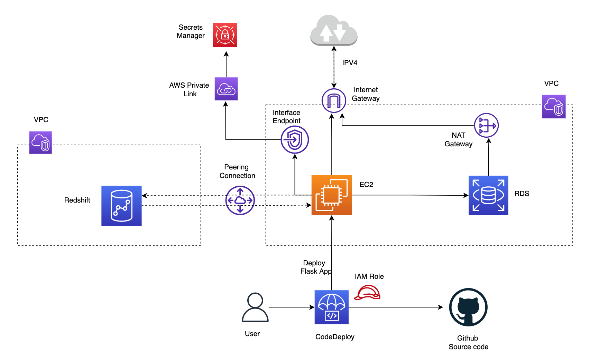
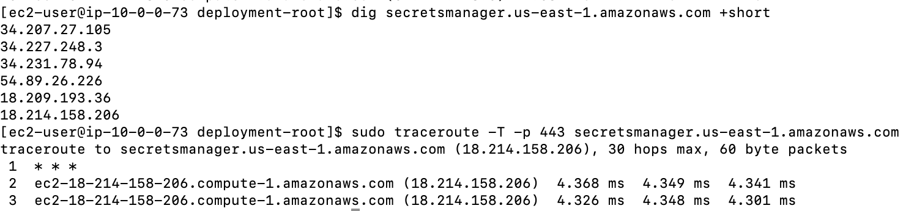
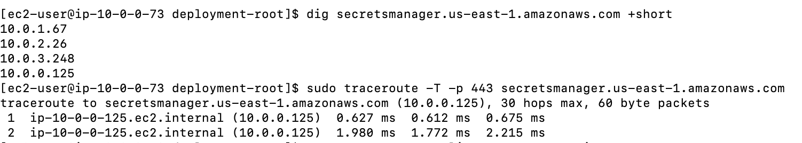
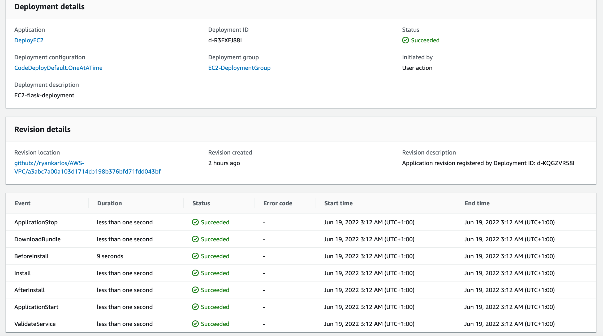
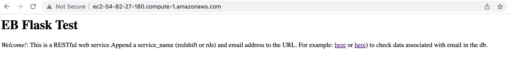
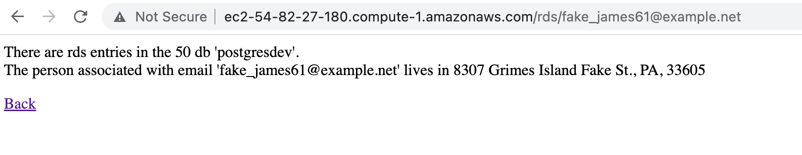
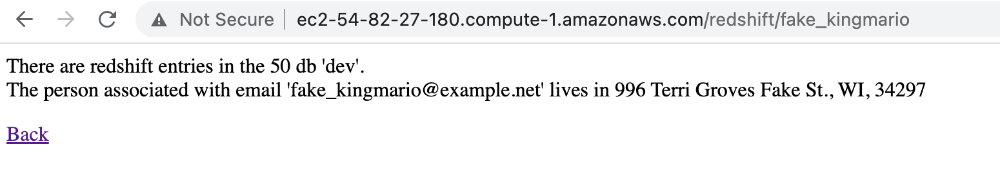
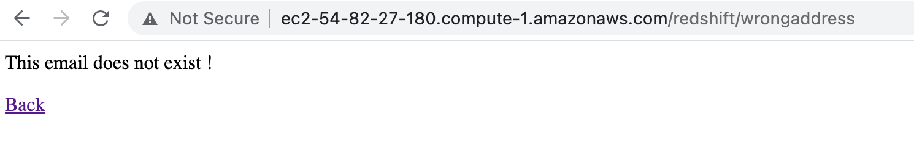
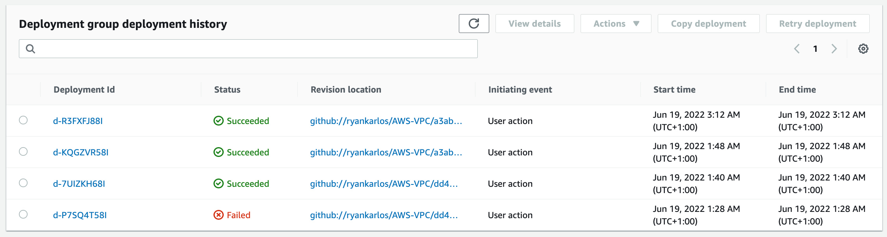

## Deploying Flask App to EC2

In this example we will create a web server running on an Amazon EC2 instance and create a MySQL database instance.
Both the Amazon EC2 instance and the DB instance run in a virtual private cloud (VPC) based on the Amazon VPC service.
you specify the VPC, subnets, and security groups when you create the DB instance. You also specify them when you
create the EC2 instance to host your web server. The VPC, subnets, and security groups are required for the
DB instance and the web server to communicate. After the VPC is set up, this tutorial shows you how to create
the DB instance and install the web server. You connect your web server to your DB instance in the VPC using
the DB instance endpoint endpoint.

This example is based on the [tutorials](https://docs.aws.amazon.com/AmazonRDS/latest/UserGuide/CHAP_Tutorials.WebServerDB.CreateVPC.html#CHAP_Tutorials.WebServerDB.CreateVPC.VPCAndSubnets) in AWS docs, but uses a more programmatic approach for illustration.

We will need the following requirements:
1) Web server hosted in EC2 instance
2) RDS DB in same VPC as EC2 but not accessible from internet
3) Redshift DB which is in another VPC and must not have public accessibilty
4) Allow communication between web server (hosted in EC2) and RDS DB (in same vpc) and Redshift (in another VPC)
5) Communication to secrets manager for credentials must not go via internet

### Running application locally

Assuming the virutal enviornment `venv` has been setup as described in this [section](../README.md#setup-virtual-environment) , run the [application.py](https://github.com/ryankarlos/AWS-VPC/blob/master/aws_vpc/aws-flask/application.py) script from the command line as below. This should show the address the server is running on. Navigate to this .e.g[http://127.0.0.1:5000](http://127.0.0.1:5000) as in logs below

```
(venv) $ python application.py

 * Serving Flask app 'application' (lazy loading)
 * Environment: production
   WARNING: This is a development server. Do not use it in a production deployment.
   Use a production WSGI server instead.
 * Debug mode: on
 * Running on http://127.0.0.1:5000 (Press CTRL+C to quit)
 * Restarting with stat
 * Debugger is active!
```

Now we will deploy and run this application on AWS EC2 instance inside a VPC and access it from our
web browser by configuring security rules

### Deploying to EC2 instance in VPC with RDS DB in same VPC and Redshift cluster in different VPC

We have two methods of deploying to EC2 instance:

* configuring code deploy  and creating deployment to EC2 instance
* using elastic beanstalk to automatically deploy and manage infrastucture

The elastic beanstalk approach is described in a separate page [here](aws-flask). In this section, we will describe the approach using AWS Code Deploy.

 

The cloudformation nested stack in templates folder (instructions in `Create AWS resource using CloudFormation` section
in the README.md at root of the repo) automatically creates the application and
deployment group with configuration required for code deployment to EC2 instance. To account for the requirements, we have created an EC2 instance in public subnet and RDS database in a private subnet in same VPC and Redshift in another VPC. Redshift is in public subnet but the public accessibility option is disabled.
A NAT gateway would allow outbound traffic from RDS in private subnet to reach the internet via the internet gateway if required
but prevent any inbound access. The inbound rules for RDS security group should allow tcp access from EC2 to port 5432 on which postgres is available.
To communicate between EC2 and Redshift in different VPC we have set up VPC peering connection and added this to the route tables for subnets where redshift and EC2 are created. We have also configured inbound rules to allow traffic from security groups atatched to EC2 and Redshift on port 5439.
Finally, an interface endpoint for secrets manager, powered by AWS Private Link would ensure traffic only goes through the AWS network.

To test this we can check the DNS resolution for the secrets manager private DNS name (`secretsmanager.us-east-1.amazonaws.com`)  and traceroute. The Secrets manager DNS name should start resolving to private IPs (Endpoint ENI IPs) if interface endpoint config is setup correctly and private DNS for the endpoint is enabled (this allows making API requests to Secrets Manager using its default DNS name e.g.`secretsmanager.us-east-1.amazonaws.com`

 

Below is an example of DNS resolution for the Secrets manager DNS name before interface endpoint was created. This resulted in public IP
address.Here, the traffic between my Public EC2 instance and Secrets manager service is through Internet Gateway.

 

In addition,when the EC2 instance is created, the code deploy agent is also installed and started.
Alternatively, the agent can be installed manually on Amazon Linux instance as described in the [docs](https://docs.aws.amazon.com/codedeploy/latest/userguide/codedeploy-agent-operations-install-linux.html)
When we first create deployment using the command below ([Reference](https://docs.aws.amazon.com/cli/latest/reference/deploy/create-deployment.html))
- we specify the names of existing  deployment group and application name and source code location (either github or S3).
Additionally we can specify optional arg for `file-exists-behaviour`.If existing files from
previous deployment are found - this will fail the deployment by default so we will set  this to overwrite.

```
aws deploy create-deployment \
    --application-name DeployEC2 \
    --deployment-group-name EC2-DeploymentGroup \
    --description EC2-flask-deployment \
    --file-exists-behavior OVERWRITE \
    --github-location repository=ryankarlos/AWS-VPC,commitId=a3abc7a00a103d1714cb198b376bfd71fdd043bf

{
    "deploymentId": "d-KQGZVR58I"
}
```

 We can also set `--ignore-application-stop-failures` option to control what happens if ApplicationStop ,
  BeforeBlockTraffic , or AfterBlockTraffic deployment lifecycle eventdeployment lifecycle event to an
  instance fails. The default behaviour during a deployment is that the AWS CodeDeploy agent runs the
  scripts specified for ApplicationStop (BeforeBlockTraffic/AfterBlockTraffic if present) events
  in the AppSpec file from the previous successful deployment.
All other scripts are run from the AppSpec file in the current deployment. If one of these scripts contains
  an error and  does not run successfully, the deployment can fail. Hence to prevent this we can either

    * Set `--ignore-application-stop-failures` to specify that the ApplicationStop , BeforeBlockTraffic , and
      AfterBlockTraffic failures should be ignored. This is the recommended way

    * ssh into the EC2 instance and delete ou can delete the file, that CodeDeploy uses to keep track of the
      previous successful deployment in the following path `/opt/codedeploy-agent/deployment-root/deployment-instructions/`

We have defined an [AppSpec file](https://github.com/ryankarlos/AWS-VPC/blob/master/appspec.yml) for codedeploy to run the tasks
on the instance, following the example listed in the [AWS docs](https://docs.aws.amazon.com/codedeploy/latest/userguide/reference-appspec-file.html#appspec-reference-server)

The CodeDeploy agent copies the application revision files in github source location to a temporary location:
`/opt/codedeploy-agent/deployment-root/deployment-group-id/deployment-id/deployment-archive` folder on
Amazon Linux. During the deployment lifecycle Install event, the CodeDeploy agent copies the revision files
from the temporary location to the final destination folder.
The source and destination path of the main application files (`aws-vpc/aws-flask`) to be copied over is
specified in  the files section of the AppSpec.yaml. If we ssh into ec2 instance after successful deployment,
we should see the application files in `/home/ec2-user/sample-app` from where the application is run.

The hooks section contain the various lifecycle events as described in the [AWS docs](https://docs.aws.amazon.com/codedeploy/latest/userguide/reference-appspec-file-structure-hooks.html)Here, we use some of these for the flask deployment as described below:

* **ApplicationStop** 
Runs this script(https://github.com/ryankarlos/AWS-VPC/blob/master/aws_vpc/code-deploy/stop_server.sh). This deployment lifecycle event occurs even before the application revision is downloaded.It stops the flask server which is currently running - which will be restarted in the ApplicationStart step with the most recent changes to the application code.

* **BeforeInstall** 
Runs [preinstall tasks](https://github.com/ryankarlos/AWS-VPC/blob/master/aws_vpc/code-deploy/install_dependencies.sh) like updating already installed packages, installing python3.8 and postgresql/psql in the container

* **AfterInstall** 
Installs the python packages for flask app from requirements.txt using this [script](https://github.com/ryankarlos/AWS-VPC/blob/master/aws_vpc/code-deploy/install_pip_requirements.sh)

* **ApplicationStart** 
Start flask server  or restart it after it was stopped during ApplicationStop event.This [script](https://github.com/ryankarlos/AWS-VPC/blob/master/aws_vpc/code-deploy/start_server.sh) runs the application silently and redirects all stdout and stderr to dev/null.This is necessary to allow the codedeploy event to succeed/exit successfully after the web server is started. Else it will stall and fail after the specified timeout (300 secs)

 

If deployment is successful, we should be able to see the main page if navigate to the public ipv4 address for the ec2 instance (e..g
http://ec2-54-82-27-180.compute-1.amazonaws.com)

 


we can navigate to the child pages by appending `/<redshift/rds>/<email-address>` and checking the associated details for the email address in
the respective db (in RDS or Redshift)

 

We can also enter the first part of the email address (e.g without the domain) and it should return the results

 

If the email is entered incorrectly, then an error is returned

 

We can track the status of past deployments for this application in  CodeDeploy deployment group


