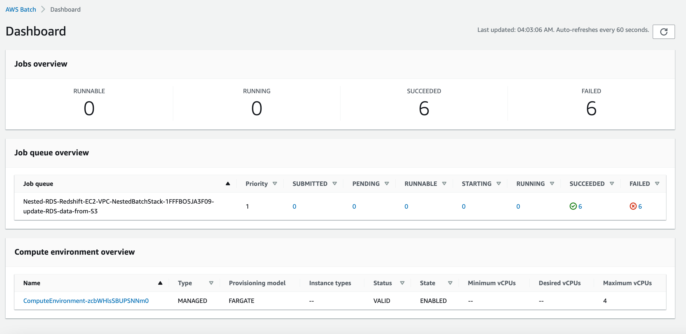
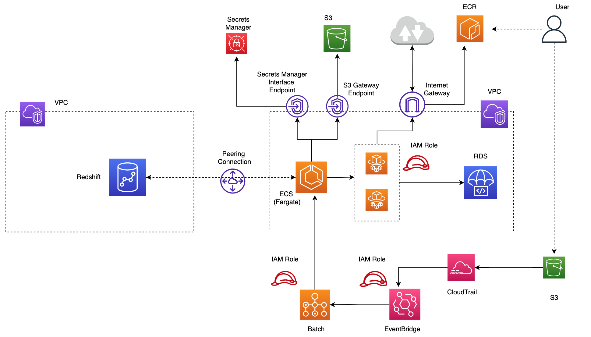
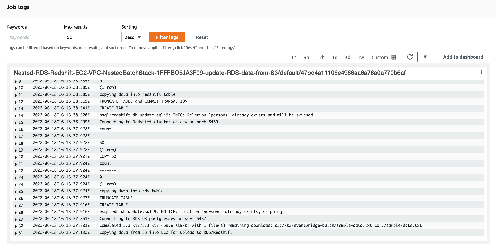

## Configuring AWS Batch Job to update DB on S3 data update

[AWS Batch]( https://docs.aws.amazon.com/batch/latest/userguide/what-is-batch.html) simplifies running batch jobs across multiple Availability Zones within a Region.
It comprises the following components:

* **Job Definition**: Specifies container properties, environment variables,memory and CPU requirements etc.
 for jobs to run. You can also specify IAM roles for access to other resources [1]
 
* **Job Queue**:The Batch Job is submitted to a particular job queue, where the job resides until it's
 scheduled onto a compute environment. Each job queue can support either multiple Fargate (spot or on demand)
 or multiple EC2 types  (spot or on demand). The compute environments are used in ascending order depending 
 on the speciifed ordering (1(first) -> 2(next) -> 3(next)).For example, if two compute environments are associated with a job queue, the compute environment with a lower order integer value is tried for job placement first [1]. Also, if 1st CE has instance with 2vCPU and other CE has instance with 4vCPU. If job needs 2vCPU it will start 1st CE until Max VCPU is reached, and then it will start the 2nd CE. On other hand, if job needs more than 2vCPU let’s say 3 or 4 vCPU then it will start the 2nd CE. 
  
* **Compute environments** within a new or existing VPC. AWS Batch efficiently launches, manages, and terminates compute
  types (serverless Fargate or managed EC2)  as needed. You can also manage your own compute environments [1].

In the example below, we will trigger a batch job to uplaod data from S3 into RDS and Redshift
databases. Once the [cloud formation template instructions](https://github.com/ryankarlos/AWS-VPC#create-aws-resource-using-cloudformation)  have been followed, you should have the batch job definition, queue and compute resources required for this task.  The job definiton should also have the cmd parameters i.e.
script to execute once the container is deployed and running in ECS Fargate (on demand) compute env.
Ive chosen [Fargate](https://docs.aws.amazon.com/batch/latest/userguide/fargate.html) rather than EC2 in this example as the job is small and the benefits Fargate provides i.e. not having to provision,configure, or scale clusters of Amazon EC2 instances to run containers. 
This removes the need to choose server types, decide when to scale your clusters, or optimize cluster packing. 
In cloudformation, all that is needed in the configuration is the maximum total vCPU of the jobs running in the Fargate compute environment

Configure cloudtrail to log data events for S3 _PutObject API_ operations in the bucket where the sample data is stored, by following this [link](https://docs.aws.amazon.com/awscloudtrail/latest/userguide/logging-data-events-with-cloudtrail.html). This means that whenever the data is uploaded to the S3 bucket with the _PutObject API_ operation, it matches the settings for this trail, which will process and log the event.

Once AWS CloudTrail to set up and configure a trail to receive these events, we can [set up
Amazon EventBridge]( https://docs.aws.amazon.com/eventbridge/latest/userguide/eb-log-s3-data-events.html) to match these events

Cloudformation template [batch-job.yaml](https://github.com/ryankarlos/AWS-VPC/blob/master/templates/batch-job.yaml) does this by creating a rule with event pattern to match _PutObject API_ calls to specified bucket and object logged in CloudTrail. We also set a target for
this rule to trigger a batch job in batch job queue created with  parameters specified in the job
definition (i.e. docker image ECR path and script entrypoint)

We can check the batch dashboard to check the job definiton, compute env and job queue configured and
status of jobs in job queue.

 

The image below shows the architecture described above, starting from a user uploading the data to S3,
which triggers a batch job via EventBridge rule. Batch will then create compute environment and assign
it the task for running job.

 

### Build docker image and push to ECR

Before triggering the batch job we need to create a dockerfile and build the docker image and push to
ECR. The image uri can then be specified in the batch job definition so it deploys and runs container
with the required dependencies and up to date script for executing the data upload to RDS and Redshift.
The bash script [ecs-image.sh](https://github.com/ryankarlos/AWS-VPC/blob/master/aws_vpc/batch/ecs-image.sh) will build the docker image from the commands in [dockerfile](https://github.com/ryankarlos/AWS-VPC/blob/master/Dockerfile). We need to specify the AWS account id <ACCT_ID> for creating the correct ECR uri to push to.

````
sh scripts/docker/ecs-image.sh <ACCT_ID>

[+] Building 36.0s (14/14) FINISHED
 => [internal] load build definition from Dockerfile                       0.0s
 => => transferring dockerfile: 428B                                       0.0s
 => [internal] load .dockerignore                                          0.0s
 => => transferring context: 2B                                            0.0s
 => [internal] load metadata for docker.io/library/amazonlinux:latest      2.0s
 => [internal] load build context                                          0.0s
 => => transferring context: 1.12kB                                        0.0s
 => [1/9] FROM docker.io/library/amazonlinux:latest@sha256:246ef631c75ea8  0.0s
 => CACHED [2/9] RUN yum -y install unzip aws-cli                          0.0s
 => [3/9] RUN amazon-linux-extras install python3.8 -y                    22.9s
 => [4/9] RUN amazon-linux-extras install postgresql10                     8.2s
 => [5/9] ADD aws_vpc/batch/update-db.sh /tmp/update-db.sh                 0.0s
 => [6/9] ADD sql/rds-db-update.sql /tmp/rds-db-update.sql                 0.0s
 => [7/9] ADD sql/redshift-db-update.sql /tmp/redshift-db-update.sql       0.0s
 => [8/9] RUN chmod +x /tmp/update-db.sh                                   0.4s
 => [9/9] WORKDIR /tmp                                                     0.0s
 => exporting to image                                                     2.2s
 => => exporting layers                                                    2.2s
 => => writing image sha256:beec1e752b7bf81c12e332d923319b55cff2820cf448c  0.0s
 => => naming to docker.io/library/awsbatch-rds                            0.0s
Login Succeeded
The push refers to repository [<ACCT_ID>.dkr.ecr.us-east-1.amazonaws.com/awsbatch-rds]
5f70bf18a086: Layer already exists
374c4222b9e1: Pushed
14679570a55f: Pushed
aed807940e63: Pushed
5f0c96b8fba7: Pushed
4f1ed007001e: Pushed
8fcc60dd6b69: Pushed
8aac9b525d16: Layer already exists
2ce46c79ab58: Layer already exists
latest: digest: sha256:811461221b1ea602e33dc8fec236ca4a08861aa446d1c8d39a2ef9135db4444c size: 2202

````


### Upload data to S3 and trigger Batch Job

Next we need to create a bucket `s3-eventbridge-batch` in S3 from the console. We will also need to create a trail to log the object-level operations on the S3 bucket, as we have configured Amazon EventBridge rules to match these events.
In the [CloudTrail console](https://console.amazonaws.cn/cloudtrail/):

1. For Trail name, type a name for the trail.
2. Select `Create a new S3 bucket` in the Storage Location option
3. Select`Data event` in Event type. Specify the S3 bucket and the object prefix, so that when an event occurs this object, the trail will log the event. We will choose to log Write events for this resource. 
4. Create Trail

Now we can create a put event by copying the [sample-data.txt](https://github.com/ryankarlos/AWS-VPC/blob/master/data/sample-data.txt) into s3 bucket path as below.

```bash
aws s3 cp data/sample-data.txt s3://s3-eventbridge-batch/sample-data.txt
```

This will log an event in cloudtrail and matched by EventBridge rule which will trigger the batch job. 
Once the job is submitted to the batch queue it will enter SUBMITTED state and will procees through the phases until finally either succeeding or failing [2]. The logs are available when the job is in RUNNING state. The Batch logs show that the Job runs and performs the operation based on the pushed container image. The job uploads data to RDS and Redshift tables

 

### References

1. https://docs.aws.amazon.com/batch/latest/userguide/what-is-batch.html
2. https://docs.aws.amazon.com/batch/latest/userguide/job_states.html

<p align="center">
    <a href="../../README.md">Home</a>  
</p>

